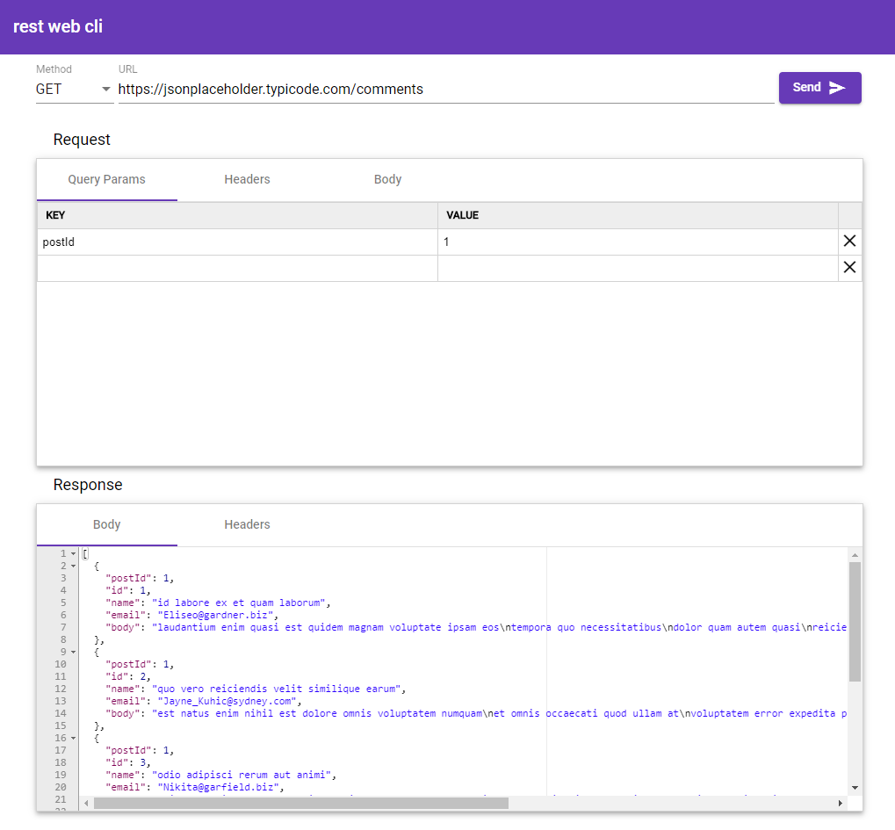

# rest web cli

:cloud: REST Web Client project created to experiment with [Angular](https://angular.io), [Angular Material](https://material.angular.io) and [ACE Editor](https://ace.c9.io)

As of now, for both request and response it will support only `Content-Type: application/json` 

&nbsp;
